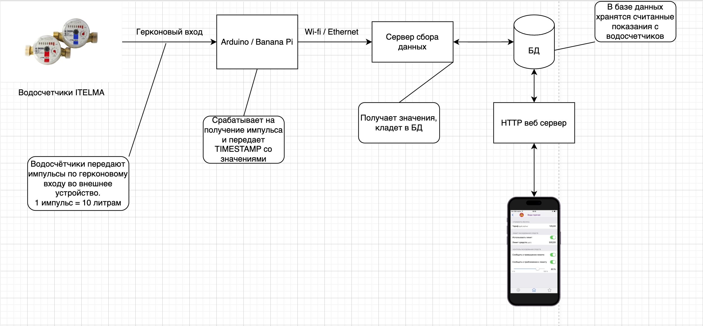
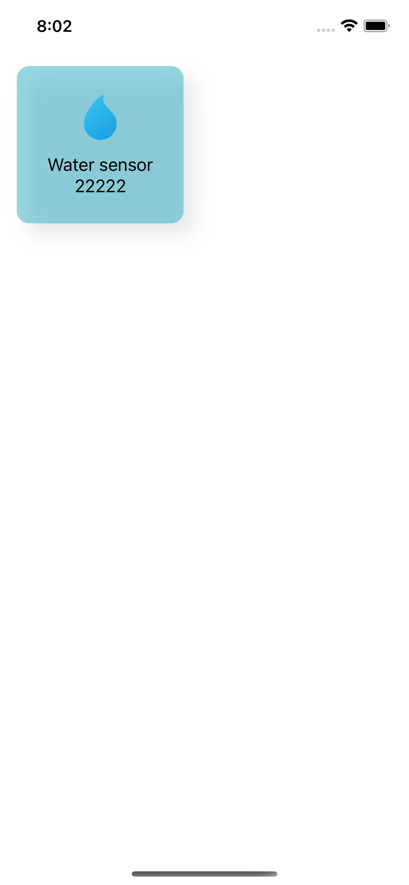
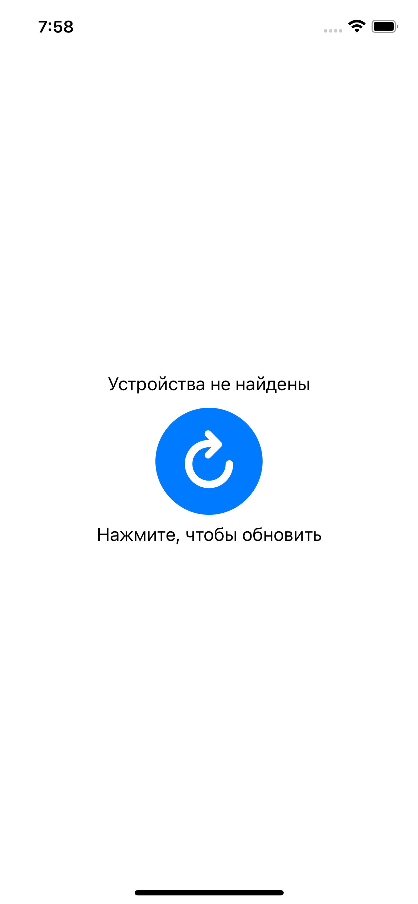
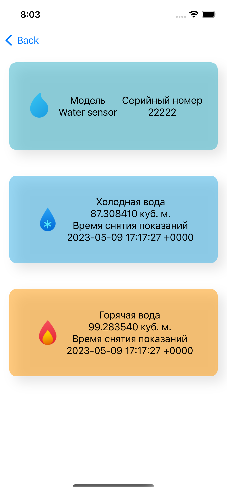
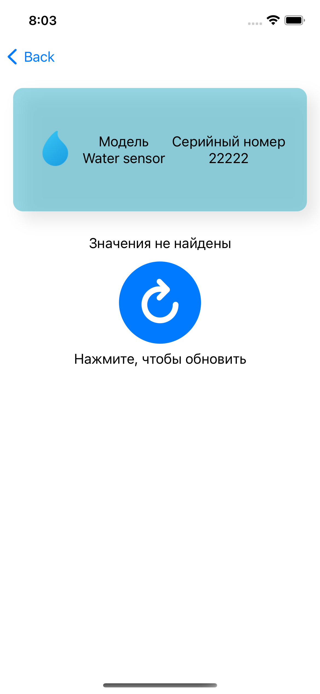
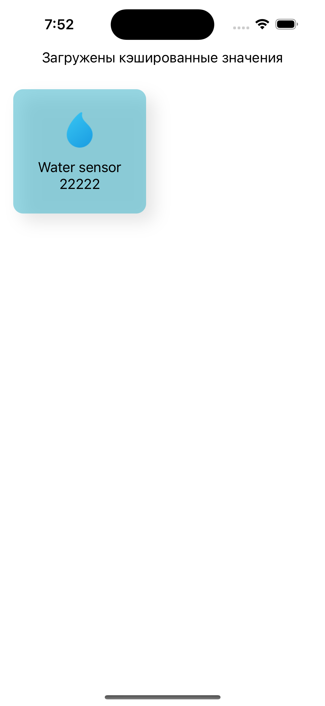
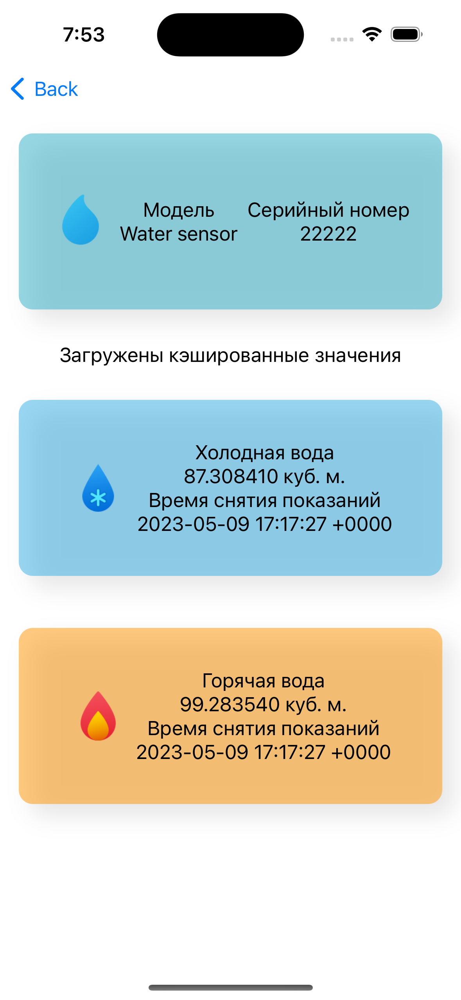
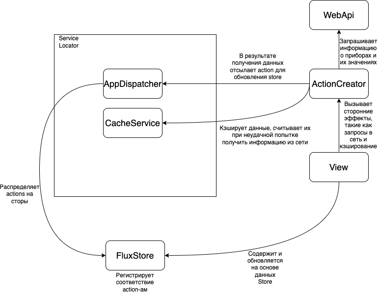

# SnsrViewer - мониторинг значений счетчиков

Фронт для проекта "Сенсорика" - мини системы, которая позволяет считывать показания с приборов мониторинга окружающей среды.

## Описание

Приложение позволяет визуализировать данные, считанные [snsrCollecor](https://github.com/mivafoxy/snsrCollector). Система позволяет заводить модели приборов и хранить данные по ним. Изначально, основной решаемой задачей всего проекта была автоматизация сбора и сохранение данных, получаемых от автономных метеорологических комплексов, но гибкость, заложенная при разработке бэкенда, позволяет расширить эту задачу до сбора данных с приборов учета энергоресурсов.

В совокупности, комплекс состоит из:
1. [Сервер сбора данных с приборов](https://github.com/mivafoxy/snsrCollector).
2. [WebApi сервер](https://github.com/mivafoxy/SnsrApi).
3. [WebApi пакет для считывания данных](https://github.com/mivafoxy/SnsrWebApi).
4. [Приложения для отображения данных](https://github.com/mivafoxy/SnsrViewer).
5. [Эмулятора устройств для тестирования системы в целом](https://github.com/mivafoxy/ps2).
6. [Мой маленький toolset для проекта на ios](https://github.com/mivafoxy/SWAPICore).

## Цель создания приложения

Получить возможность читать данные, собранные с приборов учета дома, без необходимости физического взаимодействия со счетчиками, для дальнейшей передачи информации о потреблении в управляющую компанию дома для оплаты налогов.

## Схема взаимодействия подсистем

### Пояснения

На текущем этапе реализации в приложении можно считывать данные о потреблении воды, "железная" сторона еще на  этапе разработки.

В планах сделать следующее для водосчетчиков:
1. Счетчики поддерживают подключение по *герконовому входу*, который отсылает *импульсы*.
2. По герконовому входу можно подключить либо микроконтроллер **Arduino**, либо **Banana Pi**. Выбор пал на эти приборы по причине возможности запитать их от внешнего аккумулятора без необходимости проводить новый участок электросети. Импульсы, поступаемые от счетчиков, можно воспринимать как клик мышки, реакцию на который необходимо реализовать в ПО для микроконтроллера.
3. Сам микроконтроллер должен быть подключен по сети Wi-Fi для пересылки сигнала на **Сервер сбора данных**.

Что реализовано сейчас:
1. Спроектирована база данных для хранения информации о приборах и  значениях, считанных с них. Используемая СУБД - **PostgreSQL**, поскольку с ней имеется опыт работы.
2. Разработано приложение [snsrCollecor](https://github.com/mivafoxy/snsrCollector), разработан протокол, по которому формируются и разбираются данные, которые планируется получать от "железной" стороны.
3. Разработано [RESTapi](https://github.com/mivafoxy/SnsrApi) для получения данных из БД.
4. Разработано приложение для отображения данных, получающее их через **п.3**. На текущем этапе возможно смотреть последние считанные показания с водосчетчиков для дальнейшей передачи информации в управляющую компанию.

## Детали реализации приложения

### Экран просмотра зарегистрированных в сети приборов

На экране можно увидеть приборы, полученные через [RESTapi](https://github.com/mivafoxy/SnsrApi). На текущем этапе установлено ограничение по типу - отобразить возможно только водосчетчики. Название и серийный номер прибора присылает сервер.

В случае отсутствия приборов возникает экран ошибки:

Кнопка кликабельна, отсылается запрос в сеть на загрузку приборов.

### Экран просмотра показаний водосчетчика

На этом экране можно увидеть информацию о приборе, и о данных, полученных с него в результате сбора.

В случае отсутствия значений можно увидеть экран ошибки:

.

Кнопка кликабельна, отсылается запрос в сеть на загрузку последнего считанного значения с прибора.

### Офлайн режим работы приложения

В приложении реализовано кэширование, таким образом, если нет связи с сервером, можно увидеть последние значения для ознакомления. Информация о том, что выводятся кэшированные значения, выводятся на экран.

Приложение поддерживает pull-to-refresh, так что можно пытаться получить значения и информацию о приборе. В случае отсутствия кэша, будет выводиться информация об ошибке.

### Архитектура приложения

Использован **Flux + ServiceLocator**. Сервисы для кэширования инициализируются в локаторе, используется [мой маленький toolset для проекта на ios](https://github.com/mivafoxy/SWAPICore), разработанный по курсу.

Каждый экран должен иметь две сущности - `Store` и `ActionCreator`, в Store хранятся данные и происходит реакции на смену состояний, пересылаемых с помощью `AppDispatcher`. Все запросы на работу с сетью и кэшами происходят с помощью `ActionCreator`.

Общую схему каждого экрана можно представить следующим образом:

.

## Дальнейшая судьба приложения

Кроме водосчетчиков, показания можно снимать и с электросчетчиков, с любых датчиков. К тому же, в перспективе, можно провести доработку системы, чтобы с телефона можно было отправлять команды датчикам, кондиционерам, холодильникам и всему, что является IoT. Вопрос лишь в доступности протоколов обмена данными и возможности подключения.

Также, можно реализовать функции для определения, находится ли прибор в сети, но это также требует доработки со стороны бэкенда.

К тому же, в ближайших планах сделать добавление новых устройств из приложения, а не вручную скриптами в БД.
